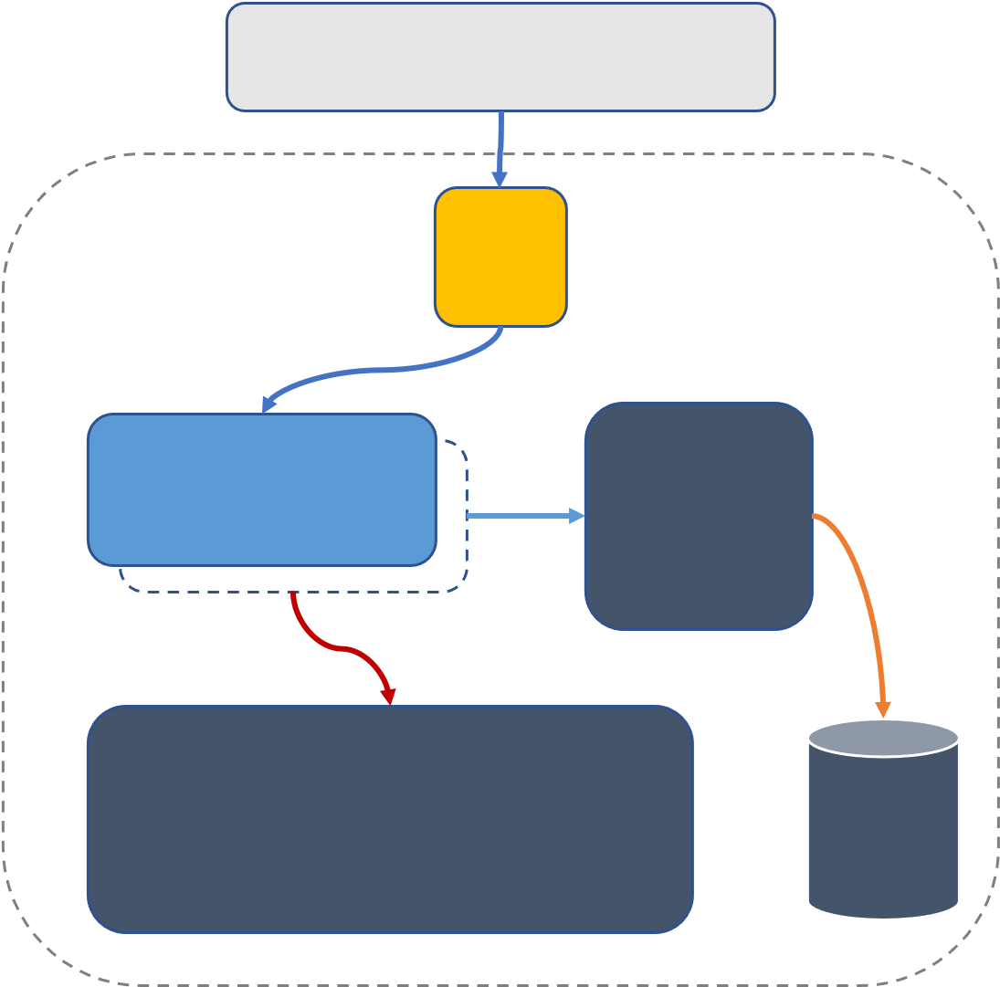

# DISCONTINUATION OF PROJECT #
This project will no longer be maintained by Intel.
Intel has ceased development and contributions including, but not limited to, maintenance, bug fixes, new releases, or updates, to this project.
Intel no longer accepts patches to this project.
# Intel® IoT Template Repository

This repository contains recommended requirements for projects hosted in the Intel® IoT GitHub organization. This 
includes naming convention, file directory and other recommendations. 

*Note: Some recommendations may not be applicable to your project.*


*An image or gif illustrating the project* 

## File Directory
```
.
├── build                   # Compiled files (alternatively `dist`)
├── src                     # Source files (alternatively `lib` or `app`)
├── test                    # Automated tests (alternatively `spec` or `tests`)
│   ├── benchmarks          # Load and stress tests
│   └── unit                # Unit tests
├── tools                   # Tools and utilities
├── LICENSE
└── README.md
```

## Table of Contents
* [Description](#description)
* [How It Works](#how-it-works)
* [Requirements](#requirements)
* [Pre-Trained Models](#pre-trained-models)
* [Setup](#setup)
* [Learn More](#learn-more)

## Description
Welcome to the instructional guide for {project name}.

This repo uses {technologies} for {value proposition} on Intel® {Hardware} systems.

## How It Works



*Reference Architecture*

## Requirements

### Operating System
* Ubuntu 18.04

### Hardware
* [Intel® Core](http://intel.ly/3pQCNAs)
* [Intel® Xeon](http://intel.ly/3pQCNAs)
* [Intel® Atom](http://intel.ly/3pQCNAs)

### Software
* [Intel® Distribution of OpenVINO™ Toolkit](https://intel.ly/2NUizIo)

### Dependencies
* Video file / Camera
* Text file
* Audio file / Microphone

## Pre-Trained Model(s)
This project uses a number of [OpenVINO optimized pre-trained models](http://intel.ly/3aGGvrV) that are accessible via the Intel® Distribution of OpenVINO™ toolkit Model Downloader tool:

### Object Detection
| Network       |
| --------------|
| [MobileNet](https://docs.openvinotoolkit.org/latest/omz_models_intel_face_detection_adas_0001_description_face_detection_adas_0001.html)       |

### Object Recognition
| Network       |
| --------------|
| [ResNet-50](https://docs.openvinotoolkit.org/latest/omz_models_intel_person_attributes_recognition_crossroad_0234_description_person_attributes_recognition_crossroad_0234.html)       |

...

## Setup
### Step 1 -
Lorem ipsum dolor sit amet, consectetur adipiscing elit, sed do eiusmod tempor incididunt ut labore et dolore magna aliqua.

### Step 2 -
Lorem ipsum dolor sit amet, consectetur adipiscing elit, sed do eiusmod tempor incididunt ut labore et dolore magna aliqua.

### Step 3 -
Lorem ipsum dolor sit amet, consectetur adipiscing elit, sed do eiusmod tempor incididunt ut labore et dolore magna aliqua.

### Step n -
Lorem ipsum dolor sit amet, consectetur adipiscing elit, sed do eiusmod tempor incididunt ut labore et dolore magna aliqua.

## Learn More

* [Intel® Edge Software Hub](http://intel.ly/2P2Q24d) - Download prevalidated software to learn, develop, and test your solutions for the edge.


* [Intel® DevCloud for the Edge](http://intel.ly/3aJwU3t) - 
  Innovate at the edge with a cloud-hosted Intel® hardware and software platform specifically designed for developers.


* [Intel® IoT Zone](http://intel.ly/2ZFUwQi) - Discover Intel® 
  software tools, documentation, certification programs as well as on-demand and upcoming Live training sessions
